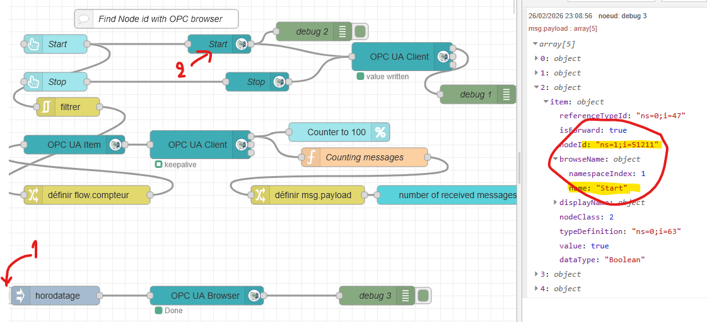
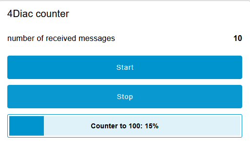

# Node-RED Dashboard for Eclipse 4diac (OPC UA)

This folder contains an example of a simple 4Diac program (OPC UA server) with a Node-RED flow that create a dashboard (HMI) to interact with the application Eclipse 4diac using the OPC UA protocol.

## Description
This dashboad show the value of the counter and have two buttons (Start and Stop) to interact with the counter.

## Prerequisites
* **Eclipse 4diac IDE** with the project `PubSubTest` loaded 
* **FORTE** runtime with OPC UA enabled.
* **Node-RED** installed.
* Palettes Node-RED : `node-red-contrib-opcua` and `@Flowfuse/node-red-dashboard`

## Installation

### 1. Configuration of 4diac
* Load the PubSubTest in 4diac IDE.
* Deploy on your runtime FORTE.

### 2. Configuration de Node-RED
Once in the Node-RED interface (http://127.0.0.1:1880 if it's running on your computer) :
* Import the file `flow.json` (Menu -> Import).
* Check the node **OPC UA Client** with the IP address of your FORTE runtime (ex: `opc.tcp://127.0.0.1:4840`).
* Deploy the Node-RED flow.
* The identifiers of the tags have to be updated: You can use your favorite OPC UA client or the `OPC UA Browser` to find the identifier of the 3 tags (ns=1;i=number). 

* Update the 3 `OPC UA Item` according to these identifiers and deploy again.

## Preview of the Dashboard
To access the Dashboard : http://127.0.0.1:1880/dashboard
You should obtain this :

*Legend : Interface to control the counter.*
Start / Stop should start or stop the counter increasing to 100 (it returns to 0 after that)

